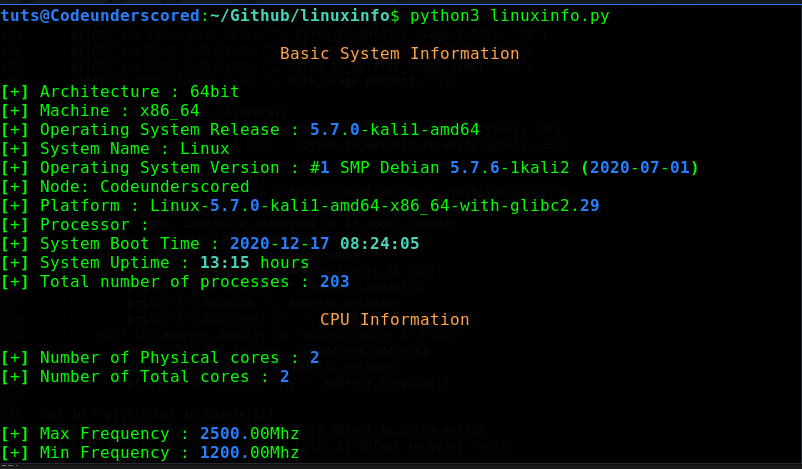

# LinuxInfo

Gather linux system and hardware information using python.

This script uses the **platform**, **psutil** and **os** module to collect information.

## Running the script

Follow the below steps for running it

- Create a virtual environment and Activate it
- activate the virtual environment
- clone this repository
- run ```pip3 install -r requirements.txt```
- Now run the script using python binaries

<br/>
See the Output Below:
<br/><br/>
